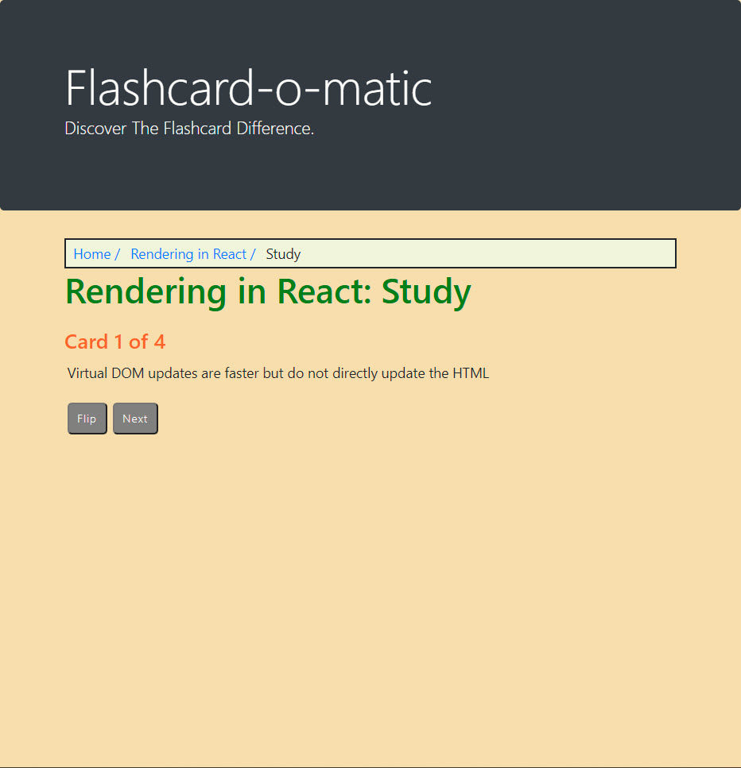
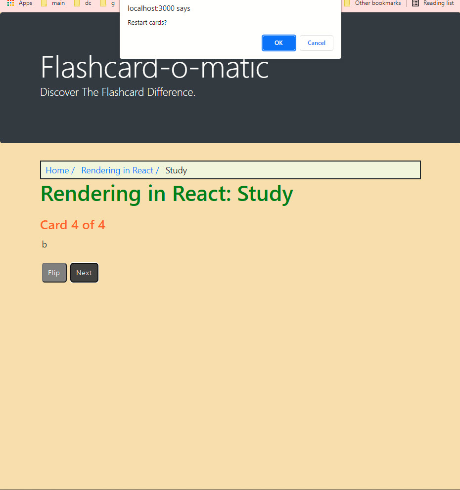
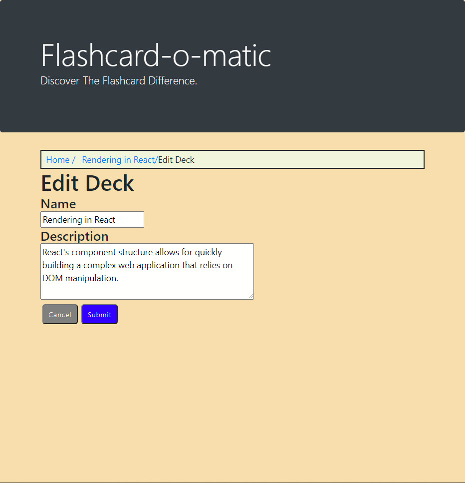
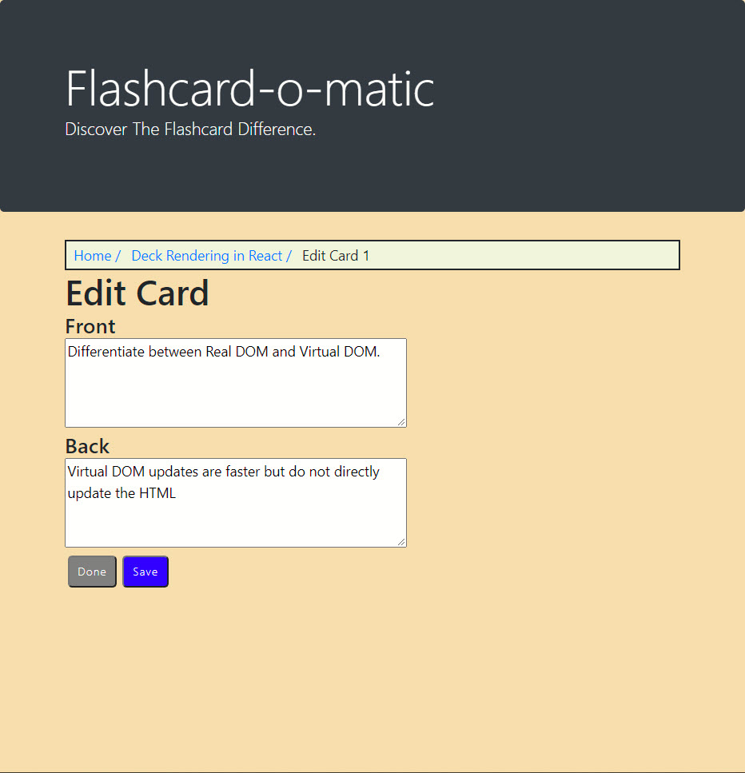
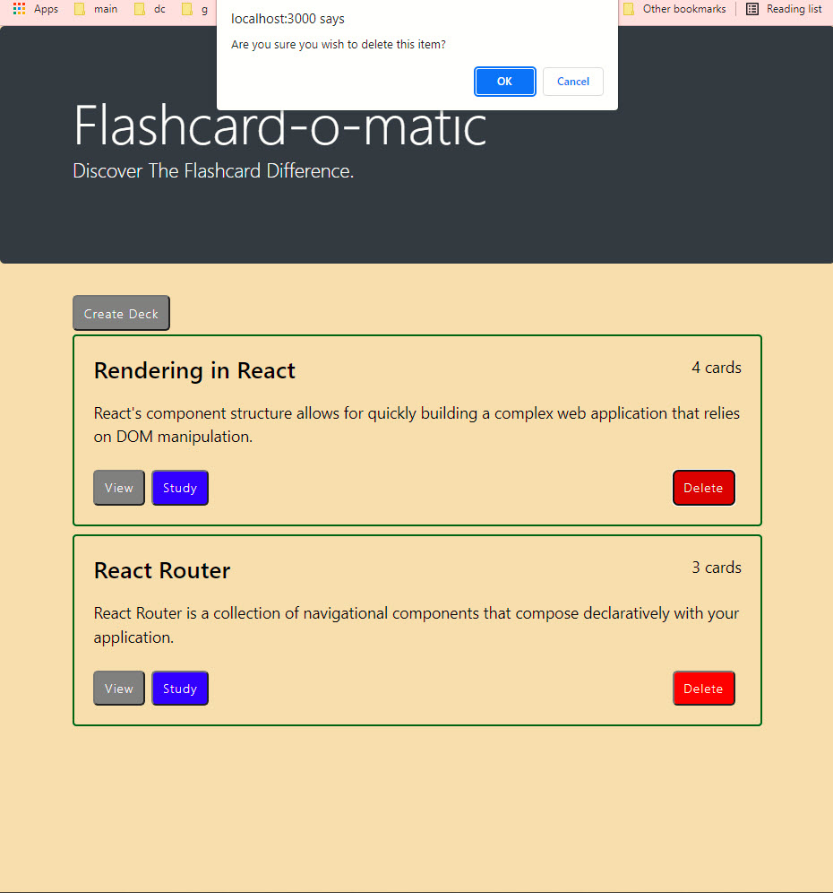
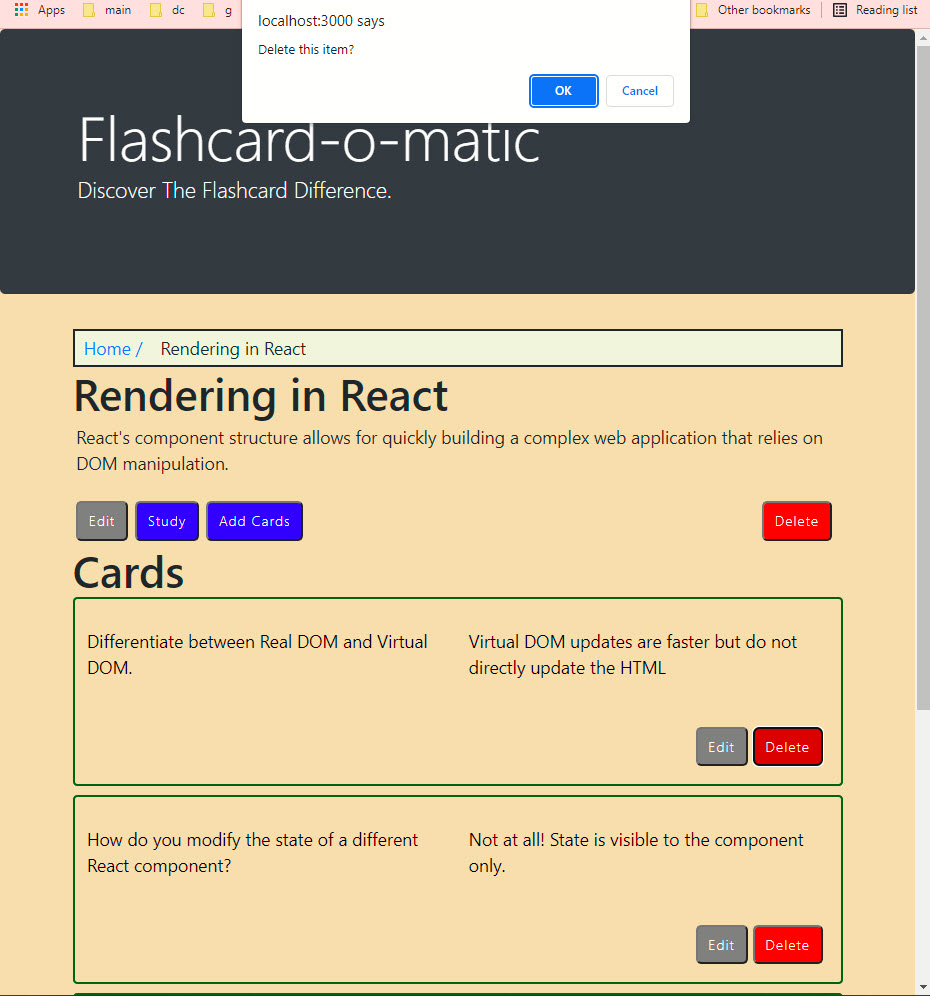

## Flashcard Application
This application allows the user to create, view, and edit flashcards and decks, respectively.

## Screenshots
### Home Page:

### Create Deck Page:

### View Deck Page:

### Study Deck Page: The page that it goes to when you click the "Study" button in the Home page or in the Deck page
### what you see when you first land on the study deck page

### what you see in between cards in the study deck page

### what you see when you reach end of deck in study deck page

### Edit Deck Page:

### Edit Card Page:

### Delete Deck Page: You can delete a deck from the home page and from the Deck page. Doing it either way will show the same pop-up box and message.

### Delete Card Page:

## Technology & Tools
Built with:
* React
* JavaScript
* HTML
* CSS
* Bootstrap

## Future Goals
Apply more Bootstrap and more CSS to make it visually appealing.
